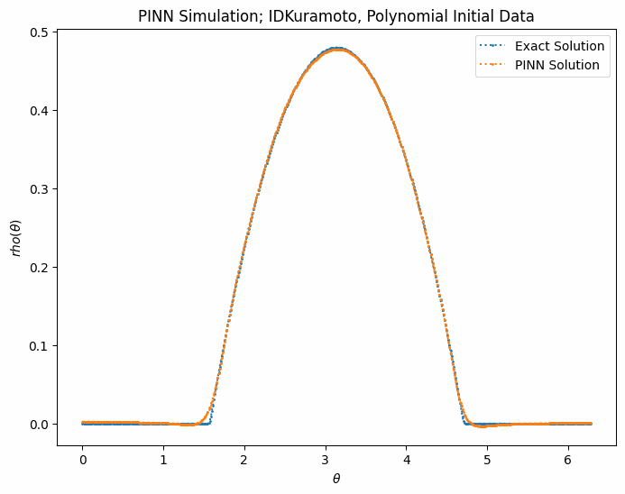

# Numerical Simulation: PINN Approach
- Explicit Finite Volume Numerical Analysis Scheme <br> 

</img> </img> </img> 

- Physics-Informed Neural Network <br>

</img> 


### Dependencies: -
1. Python
2. C++
2. matplotlib
3. NumPy
4. SciP
5. PyTorch and related libraries
6. Jupyter 

(All shell commands are for a windows environment)

```bash
git clone https://github.com/nishantak/numerical_sim_PINN.git
cd numerical_sim_PINN
pip install -r requirements.txt
```

- [Transport_Burgers](#transport_burgers-c-code)
- [Kuramoto](#kuramoto-python-code)
- [PINN Kuramoto](#pinn-kuramoto)

## Transport_Burgers C++ Code
**FV_sim.h** and **FV_sim.cpp** constitute A CUSTOM NUMERICAL ANALYSIS LIBRARY that contains _all the functions and scheme implementations._ **simulate.cpp** contains all simulation parameters and the flux definition (f(u)).

```bash
cd cpp_Transport_Burgers
g++ simulate.cpp FV_sim.cpp -o simulate && ./simulate
```

## Kuramoto Python Code
In their *respective directory*, **scheme.py** is the module that contains _the respective numerical analysis scheme implementation._ **functions.py** is the module that contains _functionality functions._ **config.py** contains all simulation parameters and the flux definition (f(u)). Set problem equation and simulation parameters in the **config.py** and **kuramoto_main.py** file
 
```bash
cd python_Kuramoto
python kuramoto_main.py
```

## PINN Kuramoto
Trains a Physics Informed Neural Network with: -
- 4 hidden layers 
- 64 units each 
- tanh activation

Predicts u(x). Check experiments and implementation in the [Notebook](/PINN_Kuramoto/pinn_solver.ipynb)

---

## Numerical Simulation 

> The core concept of a Numerical *Simulation* is to *Simulate* a differential equation.

Differential equation, in it's essence, describes "change", or in more physics terms- "evolution".
 
So, the differential equation describes- "How a physical quantity evolves or changes with respect to other physical quantities, such as time or space."

Now, one easy way to find the value of this change would be to have the solution to the equation, right?. Just have the solution -> plug in the value of the parameters -> and get the value of the change for those parameters. 

A solution would mean something like a formula such as "x = something"; where x is the change.

But, in real life we do not have such known solutions for every differential equation!

Hence, what do we do? We find the value of change from the differential equation itself. We calculate the equation via the computer (because doing so manually would be too tedious). And for small changes in the parameters, such as dx or dt, we plug in those values in our *"scheme"* and get the value of the change.

"Scheme" means how we are simulating the differential equation. We have implemented a Finite Volume Scheme, which is a type of scheme used for Numerical Analysis.

The graphs you may see in the README are representing the value of change, how the change evolves, how the physical quantity evolves w.r.t. the parameters which may be time or space.
