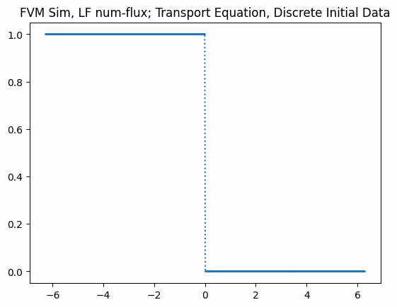
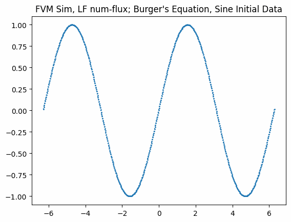
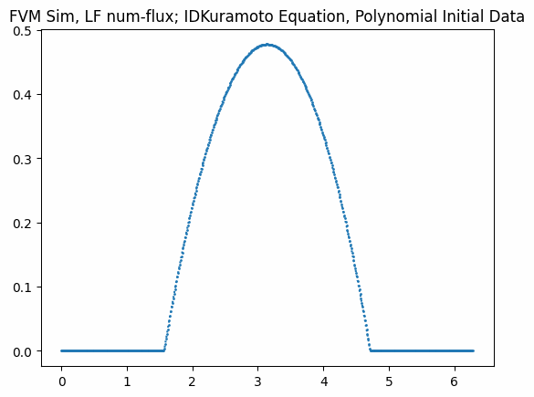

# Numerical Simulation
Finite Volume Numerical Analysis Scheme <br>

</img> </img> </img> </img> 

# Steps to run
Ensure you have the [dependencies](#Dependencies) installed and follow the steps for the problem which you want to simulate. 

(All shell commands are for a windows environment)

- [Transport_Burgers](#Transport_Burgers-C%2B%2B-Code)
- [Kuramoto](#Kuramoto-Python-Code)

### Dependencies: -
1. Python (in PATH)
2. C++ (in PATH)
2. matplotlib
3. NumPy
4. SciPy (for kuramoto)

```bash
pip install matplotlib numpy scipy
```

```bash
git clone https://github.com/nishantak/Numerical-Sim.git
cd Numerical-Sim

```
## Transport_Burgers C++ Code
**FV_sim.h** and **FV_sim.cpp** constitute A CUSTOM NUMERICAL ANALYSIS LIBRARY that contains _all the functions and scheme implementations._ **simulate.cpp** contains all simulation parameters and the flux definition (f(u)).

  1. Clone this git repository

  2. Set problem equation and simulation parameters in the **simulate.cpp** file

  3. Compile and execute the **simulate.cpp** file

```bash
cd cpp_Transport_Burgers
g++ simulate.cpp FV_sim.cpp -o simulate && ./simulate
```

## Kuramoto Python Code
In their *respective directory*, **scheme.py** is the module that contains _the respective numerical analysis scheme implementation._ **functions.py** is the module that contains _functionality functions._ **config.py** contains all simulation parameters and the flux definition (f(u)).

  1. Clone this git repository

  2. Set problem equation and simulation parameters in the **config.py** and **kuramoto_main.py** file
 
  2. Run the **kuramoto_main.py** script

```bash
cd python_Kuramoto
python kuramoto_main.py
```